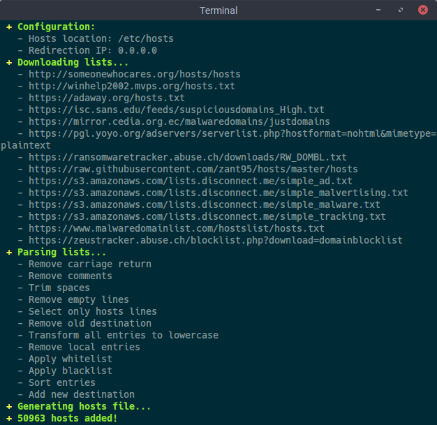
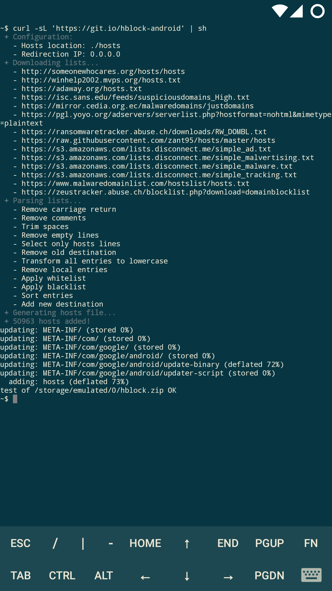

# hBlock
This shell script, designed for Unix-like systems, generates a [hosts file](http://man7.org/linux/man-pages/man5/hosts.5.html) based on [popular and reputable sources](#sources).

## What is this for?
To prevent your system from connecting to domains that serve ads, tracking scripts and malware. This will increase the security of your system and save bandwidth.

## Usage
Run latest version from GitHub:
```sh
curl -sL 'https://git.io/hblock' | sh
```
Create an [Android flashable zip](http://forum.xda-developers.com/wiki/Flashing) in your home folder:
```sh
curl -sL 'https://git.io/hblock-android' | sh
```
You can also change the default behavior using these arguments:
```
Usage: hblock [OPTION]...
 -O    Output file
 -R    Redirection IP
 -H    Hosts header
 -S    Hosts sources (space separated entries)
 -W    Whitelist (space separated entries, POSIX basic regex)
 -B    Blacklist (space separated entries)
 -y    Automatic "yes" to prompts
 -n    Automatic "no" to prompts
 -h    Print this help
```
**Note:** be sure to regularly update the hosts file for new additions or download the script and create a scheduled task.

## Preview
<table>
	<tr>
		<th>Ubuntu 16.04</th>
		<th>CyanogenMod 13.0 (OnePlus X)
	</tr>
	<tr>
		<td></td>
		<td></td>
	</tr>
</table>

## Is it safe to use?
Absolutely, this script uses regular expressions to select only the domain names of the source files, so if a source file redirects a domain name to a rogue server your system will not be affected.

## What about Windows users?
Unfortunately this script only works on Unix-like systems, but the hosts file generated is compatible with Windows systems. If you want to use this hosts file, you will need to run this script on a compatible system and then replace your current hosts file (located in `C:\Windows\System32\Drivers\etc\hosts`).

Alternatively, you can use [this project](https://github.com/StevenBlack/hosts) written in Python that has a similar approach or try [Bash on Ubuntu on Windows](https://github.com/Microsoft/BashOnWindows).

## I hear those things are awfully loud...
It glides as softly as a cloud.

## Sources
- http://someonewhocares.org/hosts/hosts
- http://winhelp2002.mvps.org/hosts.txt
- https://adaway.org/hosts.txt
- https://isc.sans.edu/feeds/suspiciousdomains_High.txt
- https://mirror.cedia.org.ec/malwaredomains/justdomains
- https://pgl.yoyo.org/adservers/serverlist.php?hostformat=nohtml&mimetype=plaintext
- https://ransomwaretracker.abuse.ch/downloads/RW_DOMBL.txt
- https://raw.githubusercontent.com/zant95/hosts/master/hosts
- https://s3.amazonaws.com/lists.disconnect.me/simple_ad.txt
- https://s3.amazonaws.com/lists.disconnect.me/simple_malvertising.txt
- https://s3.amazonaws.com/lists.disconnect.me/simple_malware.txt
- https://s3.amazonaws.com/lists.disconnect.me/simple_tracking.txt
- https://www.malwaredomainlist.com/hostslist/hosts.txt
- https://zeustracker.abuse.ch/blocklist.php?download=domainblocklist

## Disclaimer
- **Read the script** to make sure it is what you need.
- This script, by default, replaces the `/etc/hosts` file of your system. I am not responsible for any damage or loss, always make backups.

## License
See the [license](LICENSE) file.

