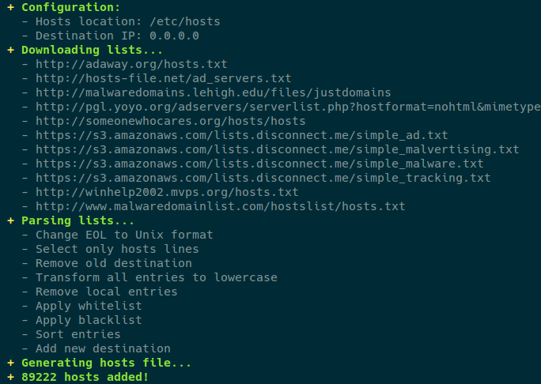

# hosts-update
This shell script, designed for GNU/Linux, generates a hosts file based on multiple sources.
- http://someonewhocares.org/hosts/hosts
- http://winhelp2002.mvps.org/hosts.txt
- https://adaway.org/hosts.txt
- https://mirror.cedia.org.ec/malwaredomains/justdomains
- https://pgl.yoyo.org/adservers/serverlist.php?hostformat=nohtml&mimetype=plaintext
- https://s3.amazonaws.com/lists.disconnect.me/simple_ad.txt
- https://s3.amazonaws.com/lists.disconnect.me/simple_malvertising.txt
- https://s3.amazonaws.com/lists.disconnect.me/simple_malware.txt
- https://s3.amazonaws.com/lists.disconnect.me/simple_tracking.txt
- https://www.malwaredomainlist.com/hostslist/hosts.txt
- https://raw.githubusercontent.com/zant95/hosts/master/hosts

## What is this for?
To prevent your computer from connecting to domains who serve ads and malware.
This will increase the security of your computer and save bandwidth.

## Usage
```
Usage: hosts-update [OPTION]...
 -O    Output file
 -R    Redirection IP
 -H    File header
 -S    Hosts sources (space separated entries)
 -W    Whitelist (space separated entries, POSIX basic regex)
 -B    Blacklist (space separated entries)
 -h    Print this help
```
Run latest version from GitHub:
```bash
curl -sL 'https://git.io/hosts-update' | sh
```
Create an Android flashable zip in your home folder:
```bash
curl -sL 'https://git.io/hosts-update-android' | sh
```

**Note:** be sure to regularly update the hosts file for new additions or download the script and create a scheduled task.

## Preview


## Disclaimer
- **Read the script** to make sure it is what you need.
- This script, by default, replaces the "/etc/hosts" file of your system. I am not responsible for any damage or loss, always make backups.

## License
See the [license](LICENSE) file.

